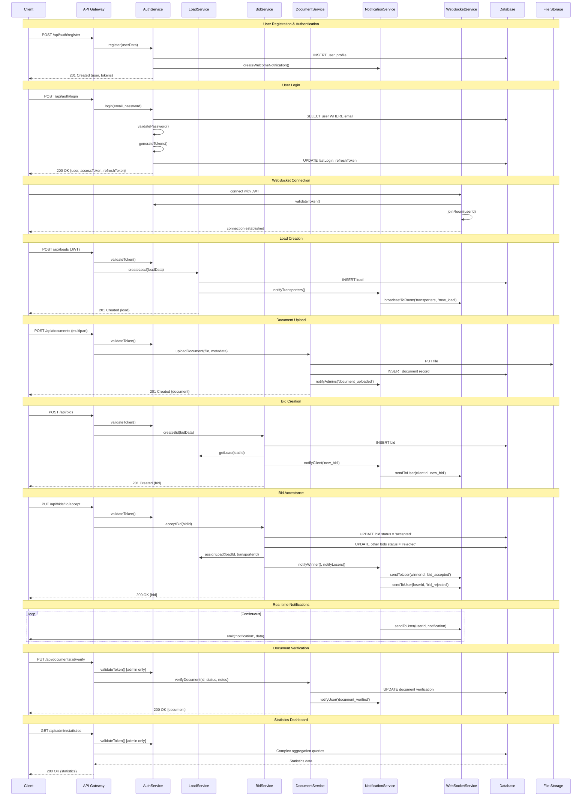

# FleetXchange Backend System Design

## Implementation Approach

We will implement a robust, scalable backend system for FleetXchange using modern technologies and best practices. The system will replace the current localStorage-based frontend with a production-ready server architecture.

### Technology Stack Selection
- **Backend Framework**: Node.js with Express.js for high performance and JavaScript ecosystem compatibility
- **Database**: PostgreSQL for ACID compliance and complex relational data
- **ORM**: Prisma for type-safe database operations and migrations
- **Authentication**: JWT tokens with refresh token rotation
- **File Storage**: AWS S3 compatible storage for document management
- **Real-time**: Socket.io for live bidding and notifications
- **API Documentation**: OpenAPI/Swagger for comprehensive documentation
- **Containerization**: Docker for deployment consistency
- **Process Management**: PM2 for production process management

### Key Challenges Addressed
1. **Data Persistence**: Replace localStorage with PostgreSQL database
2. **Authentication Security**: Implement JWT-based authentication with proper session management
3. **File Management**: Secure document upload and verification system
4. **Real-time Features**: Live bidding updates and instant notifications
5. **Scalability**: Horizontal scaling capabilities for growing user base
6. **Security**: Enterprise-level security with input validation and SQL injection prevention

## Data Structures and Interfaces

```mermaid
classDiagram
    class User {
        +UUID id
        +String email
        +String passwordHash
        +UserType userType
        +UserStatus status
        +UserProfile profile
        +DateTime createdAt
        +DateTime updatedAt
        +DateTime lastLogin
        +String refreshToken
        +validatePassword(password: String) Boolean
        +generateTokens() TokenPair
        +updateLastLogin() void
    }

    class UserProfile {
        +UUID userId
        +String companyName
        +String contactPerson
        +String phone
        +String address
        +String businessRegistration
        +String taxId
        +Boolean isVerified
        +DateTime verifiedAt
    }

    class Load {
        +UUID id
        +UUID clientId
        +String title
        +String description
        +CargoType cargoType
        +Decimal weight
        +String pickupLocation
        +String deliveryLocation
        +DateTime pickupDate
        +DateTime deliveryDate
        +Decimal budgetMin
        +Decimal budgetMax
        +LoadStatus status
        +UUID assignedTransporterId
        +DateTime createdAt
        +DateTime updatedAt
        +getBids() Bid[]
        +assignToTransporter(transporterId: UUID) void
        +updateStatus(status: LoadStatus) void
    }

    class Bid {
        +UUID id
        +UUID loadId
        +UUID transporterId
        +Decimal amount
        +DateTime pickupDate
        +DateTime deliveryDate
        +String comments
        +BidStatus status
        +DateTime createdAt
        +DateTime updatedAt
        +accept() void
        +reject() void
        +withdraw() void
    }

    class Document {
        +UUID id
        +UUID userId
        +String fileName
        +String fileUrl
        +String mimeType
        +Long fileSize
        +DocumentType documentType
        +VerificationStatus verificationStatus
        +String adminNotes
        +UUID verifiedBy
        +DateTime uploadedAt
        +DateTime verifiedAt
        +verify(status: VerificationStatus, notes: String) void
        +generateSignedUrl() String
    }

    class Message {
        +UUID id
        +UUID senderId
        +UUID receiverId
        +UUID loadId
        +String content
        +MessageType messageType
        +Boolean isRead
        +DateTime createdAt
        +DateTime readAt
        +markAsRead() void
    }

    class Notification {
        +UUID id
        +UUID userId
        +String title
        +String content
        +NotificationType type
        +Boolean isRead
        +JSON metadata
        +DateTime createdAt
        +DateTime readAt
        +markAsRead() void
    }

    class AuthService {
        +register(userData: RegisterDTO) User
        +login(email: String, password: String) AuthResponse
        +refreshToken(refreshToken: String) AuthResponse
        +logout(userId: UUID) void
        +forgotPassword(email: String) void
        +resetPassword(token: String, password: String) void
        +verifyEmail(token: String) void
    }

    class LoadService {
        +createLoad(loadData: CreateLoadDTO) Load
        +getLoads(filters: LoadFilters) Load[]
        +getLoadById(id: UUID) Load
        +updateLoad(id: UUID, data: UpdateLoadDTO) Load
        +deleteLoad(id: UUID) void
        +assignLoad(loadId: UUID, transporterId: UUID) void
    }

    class BidService {
        +createBid(bidData: CreateBidDTO) Bid
        +getBidsForLoad(loadId: UUID) Bid[]
        +getUserBids(userId: UUID) Bid[]
        +acceptBid(bidId: UUID) void
        +rejectBid(bidId: UUID) void
        +withdrawBid(bidId: UUID) void
    }

    class DocumentService {
        +uploadDocument(file: File, metadata: DocumentMetadata) Document
        +getDocuments(userId: UUID) Document[]
        +verifyDocument(documentId: UUID, status: VerificationStatus, notes: String) void
        +downloadDocument(documentId: UUID) FileStream
        +deleteDocument(documentId: UUID) void
    }

    class NotificationService {
        +createNotification(notification: CreateNotificationDTO) Notification
        +getUserNotifications(userId: UUID) Notification[]
        +markAsRead(notificationId: UUID) void
        +sendRealTimeNotification(userId: UUID, notification: Notification) void
    }

    class WebSocketService {
        +handleConnection(socket: Socket) void
        +joinRoom(socket: Socket, room: String) void
        +leaveRoom(socket: Socket, room: String) void
        +broadcastToRoom(room: String, event: String, data: Object) void
        +sendToUser(userId: UUID, event: String, data: Object) void
    }

    User ||--|| UserProfile : has
    User ||--o{ Load : creates
    User ||--o{ Bid : makes
    User ||--o{ Document : uploads
    User ||--o{ Message : sends
    User ||--o{ Notification : receives
    Load ||--o{ Bid : receives
    Load ||--|| User : assigned_to
    Bid }o--|| Load : belongs_to
    Bid }o--|| User : made_by
    Document }o--|| User : belongs_to
    Message }o--|| User : from
    Message }o--|| User : to
    Message }o--|| Load : about
```

## Program Call Flow



## API Endpoints Specification

### Authentication Endpoints
- `POST /api/auth/register` - User registration
- `POST /api/auth/login` - User login
- `POST /api/auth/refresh` - Refresh access token
- `POST /api/auth/logout` - User logout
- `POST /api/auth/forgot-password` - Request password reset
- `POST /api/auth/reset-password` - Reset password with token
- `POST /api/auth/verify-email` - Verify email address

### User Management
- `GET /api/users/profile` - Get current user profile
- `PUT /api/users/profile` - Update user profile
- `GET /api/users/:id` - Get user by ID (admin only)
- `PUT /api/users/:id/status` - Update user status (admin only)
- `GET /api/users` - List all users (admin only)

### Load Management
- `POST /api/loads` - Create new load (client only)
- `GET /api/loads` - List loads with filters
- `GET /api/loads/:id` - Get load details
- `PUT /api/loads/:id` - Update load (owner only)
- `DELETE /api/loads/:id` - Delete load (owner only)
- `PUT /api/loads/:id/assign` - Assign load to transporter

### Bidding System
- `POST /api/bids` - Create bid (transporter only)
- `GET /api/bids/load/:loadId` - Get bids for load
- `GET /api/bids/user/:userId` - Get user's bids
- `PUT /api/bids/:id/accept` - Accept bid (client only)
- `PUT /api/bids/:id/reject` - Reject bid (client only)
- `DELETE /api/bids/:id` - Withdraw bid (owner only)

### Document Management
- `POST /api/documents` - Upload document
- `GET /api/documents` - List user documents
- `GET /api/documents/:id` - Get document details
- `GET /api/documents/:id/download` - Download document file
- `PUT /api/documents/:id/verify` - Verify document (admin only)
- `DELETE /api/documents/:id` - Delete document

### Messaging System
- `POST /api/messages` - Send message
- `GET /api/messages` - Get user messages
- `PUT /api/messages/:id/read` - Mark message as read
- `GET /api/messages/conversation/:userId` - Get conversation

### Notifications
- `GET /api/notifications` - Get user notifications
- `PUT /api/notifications/:id/read` - Mark notification as read
- `PUT /api/notifications/read-all` - Mark all as read

### Admin Dashboard
- `GET /api/admin/statistics` - Platform statistics
- `GET /api/admin/users` - User management
- `GET /api/admin/documents/pending` - Pending document verifications
- `GET /api/admin/system/health` - System health check

## Security Implementation

### Authentication & Authorization
- JWT access tokens (15 minutes expiry)
- Refresh tokens (7 days expiry) with rotation
- Role-based access control (RBAC)
- Password hashing with bcrypt (12 rounds)
- Email verification for new accounts
- Rate limiting on authentication endpoints

### Data Protection
- Input validation with Joi schemas
- SQL injection prevention via Prisma ORM
- XSS protection with helmet.js
- CORS configuration for frontend domains
- File upload validation and virus scanning
- Encrypted sensitive data at rest

### Infrastructure Security
- HTTPS enforcement
- Security headers (HSTS, CSP, etc.)
- API rate limiting per user/IP
- Request logging and monitoring
- Environment variable management
- Database connection encryption

## Deployment Architecture

### Production Environment
- **Application**: Node.js cluster with PM2
- **Database**: PostgreSQL with read replicas
- **File Storage**: AWS S3 with CloudFront CDN
- **Load Balancer**: Nginx with SSL termination
- **Monitoring**: Prometheus + Grafana
- **Logging**: ELK Stack (Elasticsearch, Logstash, Kibana)
- **Containerization**: Docker with Docker Compose

### Development Environment
- Local PostgreSQL database
- Local file storage
- Hot reload with nodemon
- API documentation with Swagger UI
- Database seeding for development data

## Anything UNCLEAR

The following aspects need clarification for complete implementation:

1. **Payment Integration**: Should we integrate payment gateways (Stripe, PayPal) for transaction processing?

2. **SMS Notifications**: Do you need SMS notifications for critical events (bid acceptance, document approval)?

3. **Geolocation Services**: Should we integrate mapping services (Google Maps, Mapbox) for route optimization?

4. **Email Service**: Which email provider should we use (SendGrid, AWS SES, Mailgun)?

5. **Backup Strategy**: What's the preferred backup frequency and retention policy for the database?

6. **Scaling Requirements**: Expected number of concurrent users and data volume for infrastructure sizing?

7. **Compliance Requirements**: Any specific industry compliance needs (GDPR, data residency requirements)?

8. **Third-party Integrations**: Any existing systems that need integration (ERP, accounting software)?

These clarifications will help finalize the implementation details and ensure the backend meets all business requirements.