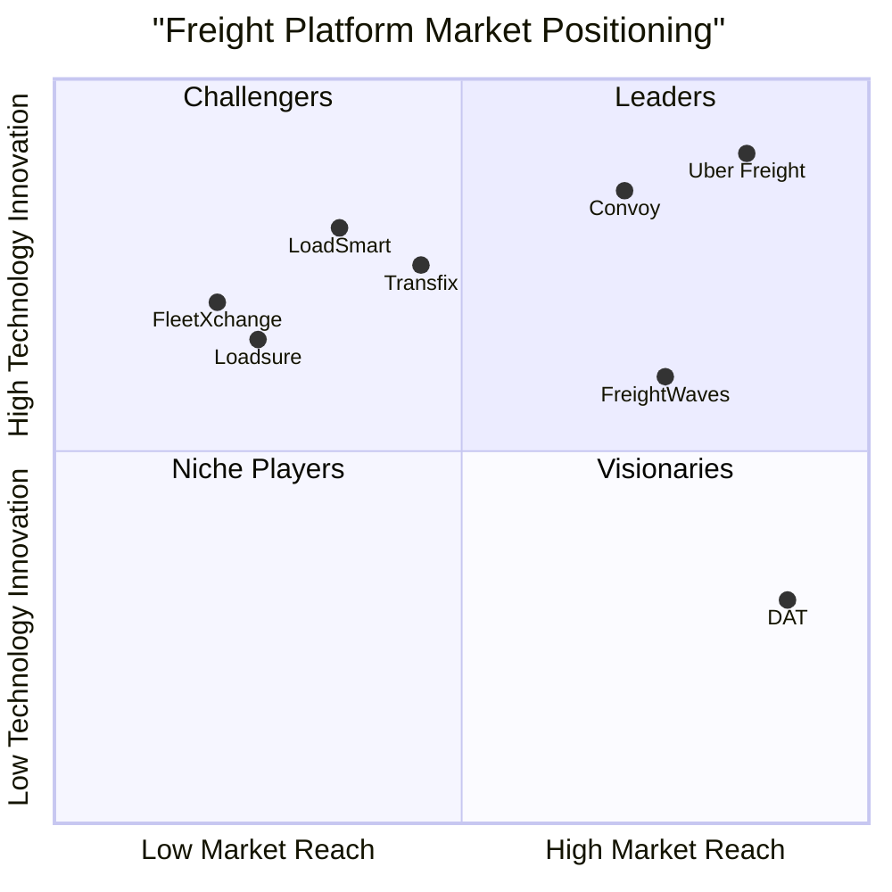

# FleetXchange Platform - Product Requirements Document (PRD)

## 1. Language & Project Information

**Language:** English  
**Programming Language:** Shadcn-ui, TypeScript, and Tailwind CSS  
**Project Name:** fleet_xchange_platform  

### Original Requirements Restatement
FleetXchange is a comprehensive logistics platform that connects clients (cargo owners) with transporters through a three-portal system: Admin Portal for registration approvals and document verification, Client Portal for load posting and transporter selection, and Transporter Portal for bidding on available loads. The platform prioritizes user verification, load management, bidding systems, and direct communication between stakeholders.

## 2. Product Definition

### 2.1 Product Goals

1. **Streamline Freight Operations**: Create an efficient digital marketplace that reduces the time and complexity of connecting cargo owners with verified transporters through automated matching and bidding systems.

2. **Ensure Compliance and Trust**: Implement comprehensive document verification and KYC processes to maintain regulatory compliance and build trust among all platform participants through verified credentials.

3. **Optimize Cost and Transparency**: Provide transparent pricing through competitive bidding while offering real-time tracking and communication tools to reduce operational costs and improve service delivery.

### 2.2 User Stories

**Admin User Stories:**
- As a platform administrator, I want to review and approve/reject registration applications so that only verified and compliant users can access the platform.
- As an admin, I want to monitor all platform activities including loads, bids, and user interactions so that I can ensure smooth operations and identify issues proactively.

**Client User Stories:**
- As a cargo owner, I want to post detailed load requirements and receive competitive bids so that I can select the most suitable transporter for my shipment needs.
- As a client, I want to communicate directly with selected transporters so that I can coordinate pickup, delivery, and any special requirements efficiently.
- As a client, I want to track my shipment status in real-time so that I can keep my customers informed and manage my logistics operations effectively.

**Transporter User Stories:**
- As a transporter, I want to view available loads that match my truck capacity and route preferences so that I can maximize my vehicle utilization and revenue.
- As a transporter, I want to submit competitive bids with my pricing and availability so that I can win more business opportunities.
- As a transporter, I want to manage my fleet documentation and driver assignments so that I can ensure compliance and operational readiness.

### 2.3 Competitive Analysis

Based on market research, here are the key competitors in the digital freight marketplace:

**1. Uber Freight**
- *Pros*: Strong brand recognition, advanced matching algorithms, real-time tracking, mobile-first approach
- *Cons*: High commission fees, limited to certain markets, complex onboarding process

**2. Convoy**
- *Pros*: Automated booking, transparent pricing, strong carrier network, good user experience
- *Cons*: Limited geographic coverage, focuses mainly on full truckload, high technology requirements

**3. FreightWaves**
- *Pros*: Comprehensive market data, strong analytics, industry insights, established network
- *Cons*: More focused on information than transactions, complex interface, expensive for small operators

**4. DAT (Dial-a-Truck)**
- *Pros*: Established industry presence, large load board, credit services, mobile app
- *Cons*: Outdated interface, limited automation, high subscription costs, manual processes

**5. Transfix**
- *Pros*: API integrations, automated processes, good customer service, technology-driven
- *Cons*: Limited carrier base, geographic restrictions, high minimum shipment values

**6. LoadSmart**
- *Pros*: AI-powered optimization, good pricing transparency, strong customer support
- *Cons*: Limited market presence, newer platform with smaller network

**7. Loadsure**
- *Pros*: Insurance integration, risk management features, compliance focus
- *Cons*: Niche focus, limited marketplace features, higher costs for insurance

### 2.4 Competitive Quadrant Chart

## 3. Technical Specifications

### 3.1 Requirements Analysis

FleetXchange requires a robust multi-tenant platform architecture supporting three distinct user interfaces with role-based access control. The system must handle document management with secure file storage, automated verification workflows, and compliance tracking. Core functionality includes user registration with KYC processes, load posting and bidding mechanisms, real-time messaging, and comprehensive reporting capabilities.

The platform needs to integrate with external services for document verification, payment processing, and potentially GPS tracking for shipments. Security requirements include data encryption, secure authentication, audit trails, and compliance with logistics industry regulations.

### 3.2 Requirements Pool

**P0 (Must-Have) Requirements:**
- Multi-portal user authentication and authorization system
- Document upload and verification workflow for all user types
- Load posting system with detailed cargo specifications
- Bidding mechanism with price and availability management
- Basic messaging system between clients and transporters
- Admin dashboard for registration approval/rejection
- User dashboards for load and bid tracking
- Secure file storage and document management
- Basic reporting functionality for platform metrics

**P1 (Should-Have) Requirements:**
- Advanced search and filtering for loads and transporters
- Automated matching algorithms based on location and capacity
- Email and SMS notifications for key platform events
- Mobile-responsive design for all portals
- Integration with payment gateways for transaction processing
- Advanced reporting with analytics and insights
- User rating and review system
- Load tracking and status updates
- API endpoints for third-party integrations

**P2 (Nice-to-Have) Requirements:**
- Mobile applications for iOS and Android
- Real-time GPS tracking integration
- Advanced analytics and machine learning recommendations
- Multi-language support
- Integration with accounting software
- Automated invoice generation
- Advanced communication features (video calls, file sharing)
- Marketplace insurance options
- Integration with fuel card providers
- Advanced fleet management tools

### 3.3 UI Design Draft

**Admin Portal Layout:**
- Header: Platform logo, admin name, logout
- Sidebar Navigation: Dashboard, Pending Registrations, User Management, Document Review, Load Monitoring, Reports
- Main Content Area: Context-sensitive content based on navigation selection
- Quick Stats Cards: Pending approvals, active users, loads posted, completed loads

**Client Portal Layout:**
- Header: Company logo, user name, notifications, settings
- Navigation Tabs: Dashboard, Post Load, Active Loads, Bid Management, Messages, Documents
- Dashboard: Load summary cards, recent activity, quick actions
- Load Posting Form: Multi-step wizard with cargo details, pickup/delivery, requirements, budget

**Transporter Portal Layout:**
- Header: Company logo, user name, notifications, settings
- Navigation Tabs: Dashboard, Available Loads, My Bids, Won Loads, Fleet Management, Messages
- Load Browser: Filterable list with map view, load details, bidding interface
- Fleet Management: Truck and driver assignment, document status, availability calendar

### 3.4 Open Questions

1. **Document Verification Process**: Should document verification be automated using OCR and AI, or manual review by admin staff? What level of verification is required for different document types?

2. **Payment Integration**: Will the platform handle payments directly or integrate with existing payment processors? What payment terms and methods should be supported?

3. **Geographic Scope**: Is this platform intended for a specific country/region, or global operations? This affects compliance requirements and document types.

4. **Load Tracking**: Should real-time GPS tracking be included in MVP, or can it be added in later phases? What level of tracking detail is required?

5. **Commission Structure**: How will the platform generate revenue? Fixed fees, percentage of transaction, subscription model, or combination?

6. **Integration Requirements**: Are there specific existing systems (ERP, accounting, fleet management) that need integration in the initial release?

7. **Scalability Requirements**: What are the expected user volumes and transaction loads for the first year? This affects infrastructure planning.

8. **Compliance Standards**: What specific regulatory requirements must be met for the target market (DOT regulations, international shipping, tax compliance)?

---

*This PRD serves as the foundation for the FleetXchange platform development. It should be reviewed and approved by stakeholders before proceeding to the design and development phases.*