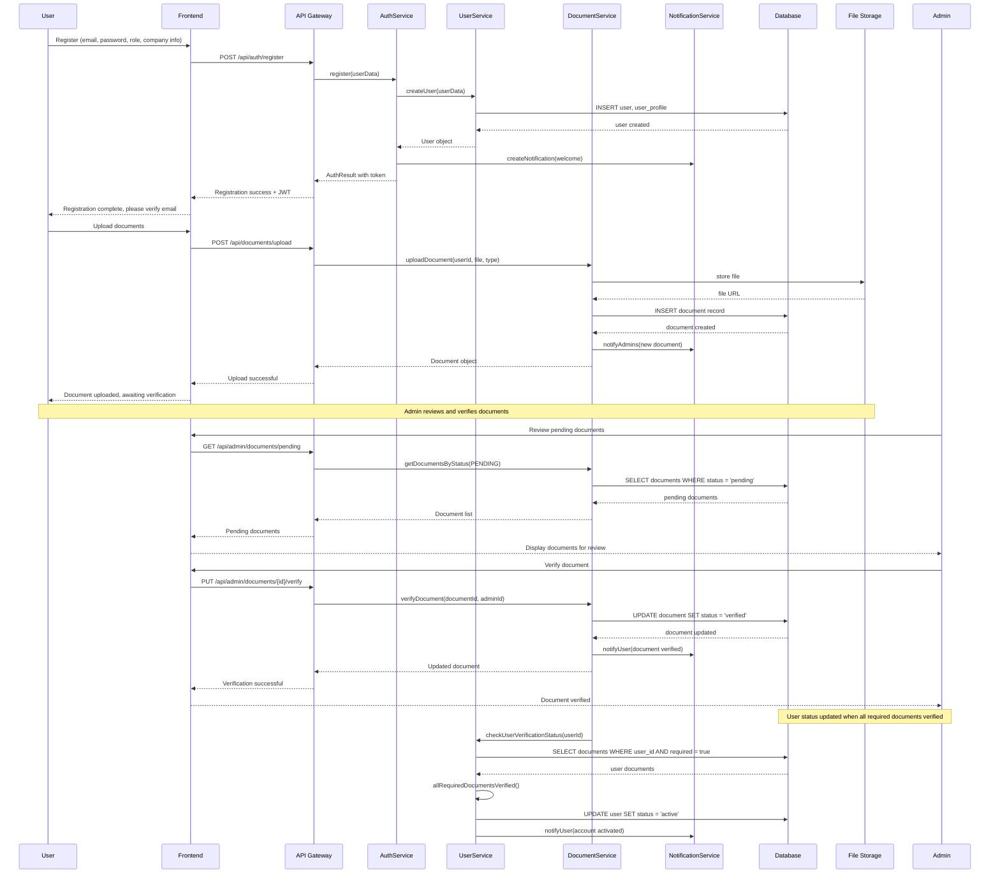
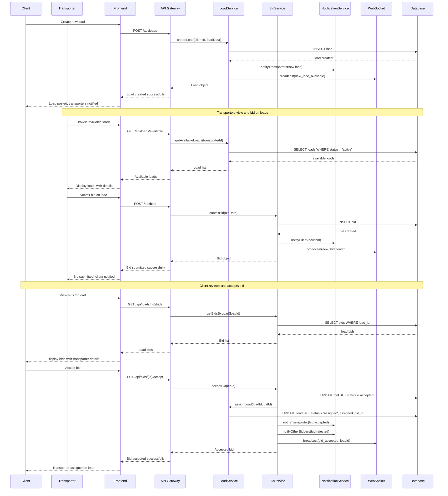
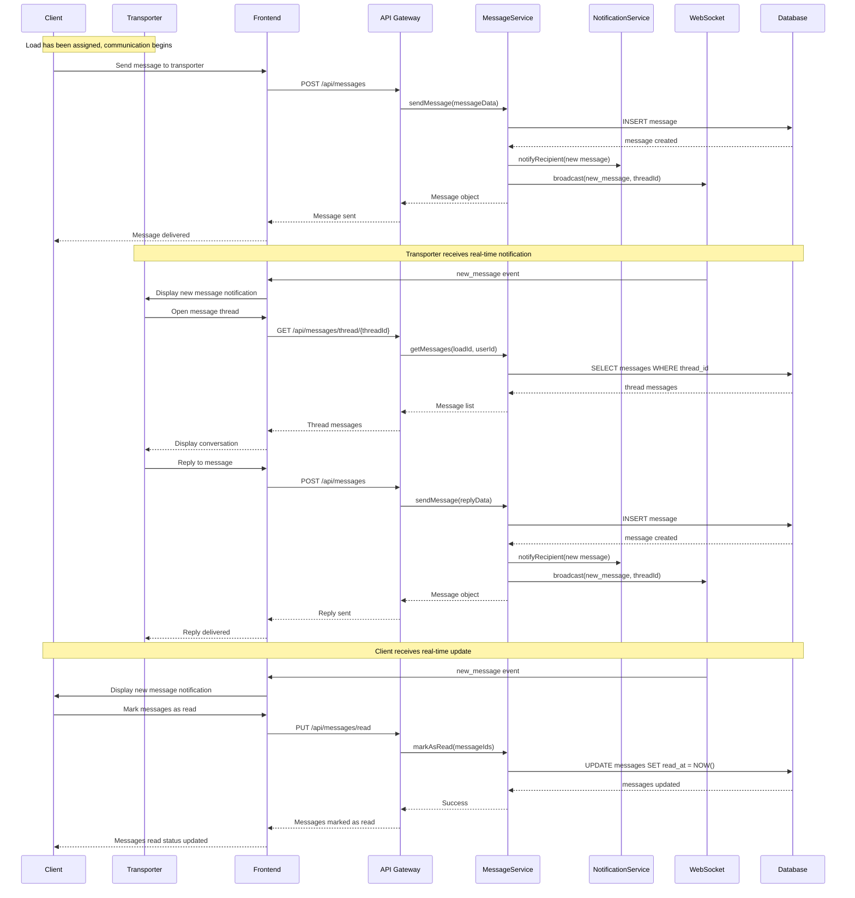
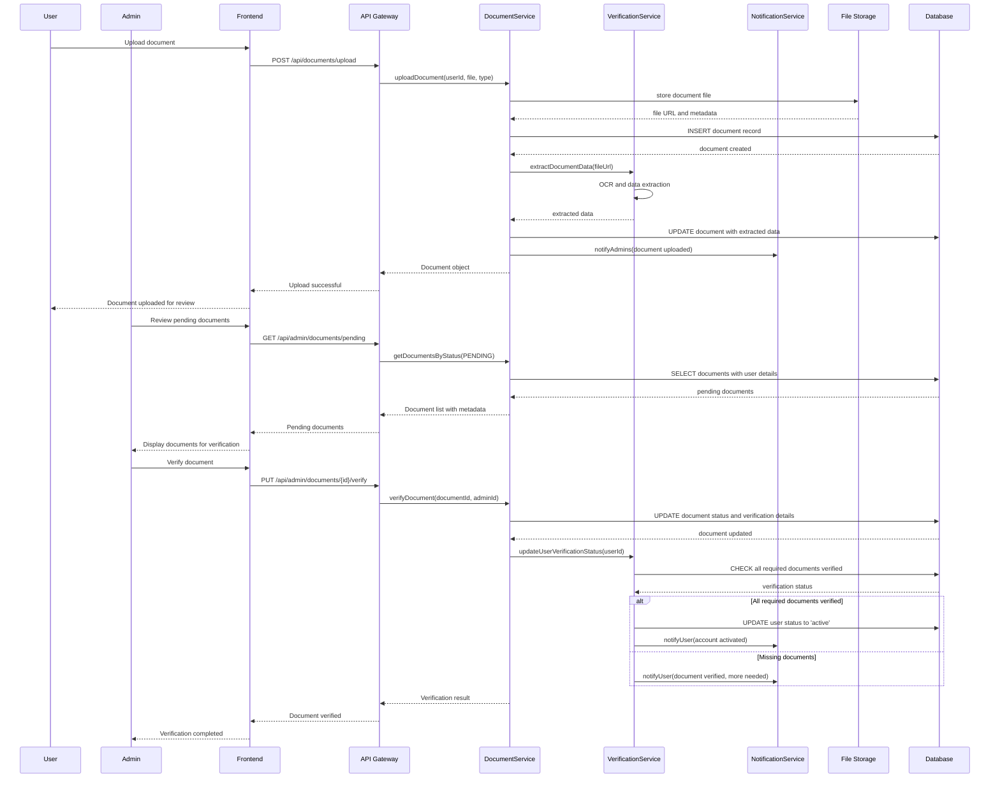

# FleetXchange Platform - System Design Document

## Implementation Approach

We will build FleetXchange as a modern web application using a microservices architecture with TypeScript, Next.js, and Shadcn-ui for the frontend, and Node.js with Express for the backend services. The system will use PostgreSQL for primary data storage, Redis for caching and real-time features, and AWS S3 for document storage.

### Technology Stack Selection

**Frontend:**
- Next.js 14 with TypeScript for server-side rendering and optimal performance
- Shadcn-ui components with Tailwind CSS for consistent, accessible UI
- React Query for state management and API caching
- Socket.io-client for real-time messaging and bidding updates

**Backend:**
- Node.js with Express.js for RESTful API services
- TypeScript for type safety and better development experience
- Prisma ORM for database operations and migrations
- Socket.io for real-time communication
- JWT for authentication and authorization
- Multer and AWS SDK for file upload handling

**Database & Storage:**
- PostgreSQL for relational data (users, loads, bids, messages)
- Redis for session management, caching, and real-time data
- AWS S3 for document storage with CloudFront CDN
- Elasticsearch for advanced search capabilities (P1 requirement)

**Infrastructure:**
- Docker containers for consistent deployment
- AWS ECS or Kubernetes for orchestration
- AWS RDS for managed PostgreSQL
- AWS ElastiCache for managed Redis
- CloudWatch for monitoring and logging

### Architecture Patterns

1. **Microservices Architecture**: Separate services for authentication, user management, document processing, load management, bidding, and messaging
2. **Event-Driven Architecture**: Use message queues (AWS SQS) for asynchronous processing
3. **CQRS Pattern**: Separate read and write operations for complex queries and reporting
4. **Repository Pattern**: Abstract data access layer for better testability
5. **Clean Architecture**: Dependency inversion for maintainable code structure

## Data Structures and Interfaces

### Core Entities and Relationships

```mermaid
classDiagram
    class User {
        +id: string
        +email: string
        +password_hash: string
        +role: UserRole
        +status: UserStatus
        +created_at: DateTime
        +updated_at: DateTime
        +last_login: DateTime
        +email_verified: boolean
        +phone: string
        +phone_verified: boolean
        +profile_id: string
        +authenticate(password: string) boolean
        +updateLastLogin() void
        +verifyEmail() void
        +verifyPhone() void
    }

    class UserProfile {
        +id: string
        +user_id: string
        +first_name: string
        +last_name: string
        +company_name: string
        +company_registration: string
        +address: Address
        +contact_person: string
        +tax_number: string
        +created_at: DateTime
        +updated_at: DateTime
        +updateProfile(data: ProfileData) void
        +getFullName() string
    }

    class Document {
        +id: string
        +user_id: string
        +document_type: DocumentType
        +file_path: string
        +file_name: string
        +file_size: number
        +mime_type: string
        +status: DocumentStatus
        +uploaded_at: DateTime
        +verified_at: DateTime
        +verified_by: string
        +expiry_date: DateTime
        +notes: string
        +uploadDocument(file: File) void
        +verifyDocument(admin_id: string) void
        +rejectDocument(admin_id: string, reason: string) void
        +isExpired() boolean
    }

    class Load {
        +id: string
        +client_id: string
        +title: string
        +description: string
        +cargo_type: string
        +weight: number
        +volume: number
        +pickup_location: Location
        +delivery_location: Location
        +pickup_date: DateTime
        +delivery_date: DateTime
        +budget_min: number
        +budget_max: number
        +status: LoadStatus
        +requirements: string[]
        +created_at: DateTime
        +updated_at: DateTime
        +assigned_transporter_id: string
        +assigned_bid_id: string
        +createLoad(data: LoadData) void
        +updateStatus(status: LoadStatus) void
        +assignTransporter(transporter_id: string, bid_id: string) void
        +calculateDistance() number
    }

    class Bid {
        +id: string
        +load_id: string
        +transporter_id: string
        +truck_id: string
        +driver_id: string
        +price: number
        +currency: string
        +estimated_pickup: DateTime
        +estimated_delivery: DateTime
        +notes: string
        +status: BidStatus
        +created_at: DateTime
        +updated_at: DateTime
        +expires_at: DateTime
        +submitBid(data: BidData) void
        +acceptBid() void
        +rejectBid() void
        +withdrawBid() void
        +isExpired() boolean
    }

    class Truck {
        +id: string
        +transporter_id: string
        +license_plate: string
        +truck_type: string
        +max_weight: number
        +max_volume: number
        +year: number
        +make: string
        +model: string
        +status: TruckStatus
        +current_location: Location
        +availability_start: DateTime
        +availability_end: DateTime
        +created_at: DateTime
        +updated_at: DateTime
        +registerTruck(data: TruckData) void
        +updateLocation(location: Location) void
        +setAvailability(start: DateTime, end: DateTime) void
        +isAvailable(date: DateTime) boolean
    }

    class Driver {
        +id: string
        +transporter_id: string
        +license_number: string
        +first_name: string
        +last_name: string
        +phone: string
        +email: string
        +license_expiry: DateTime
        +medical_cert_expiry: DateTime
        +status: DriverStatus
        +current_truck_id: string
        +created_at: DateTime
        +updated_at: DateTime
        +registerDriver(data: DriverData) void
        +assignToTruck(truck_id: string) void
        +updateStatus(status: DriverStatus) void
        +isLicenseValid() boolean
        +isMedicalCertValid() boolean
    }

    class Message {
        +id: string
        +load_id: string
        +sender_id: string
        +receiver_id: string
        +content: string
        +message_type: MessageType
        +attachments: string[]
        +sent_at: DateTime
        +read_at: DateTime
        +thread_id: string
        +sendMessage(data: MessageData) void
        +markAsRead() void
        +addAttachment(file_path: string) void
    }

    class Notification {
        +id: string
        +user_id: string
        +title: string
        +message: string
        +type: NotificationType
        +data: JSON
        +read: boolean
        +created_at: DateTime
        +read_at: DateTime
        +createNotification(data: NotificationData) void
        +markAsRead() void
        +sendEmail() void
        +sendSMS() void
    }

    class AuditLog {
        +id: string
        +user_id: string
        +action: string
        +entity_type: string
        +entity_id: string
        +old_values: JSON
        +new_values: JSON
        +ip_address: string
        +user_agent: string
        +timestamp: DateTime
        +logAction(data: AuditData) void
        +getEntityHistory(entity_id: string) AuditLog[]
    }

    %% Relationships
    User ||--|| UserProfile : has
    User ||--o{ Document : uploads
    User ||--o{ Load : posts
    User ||--o{ Bid : submits
    User ||--o{ Truck : owns
    User ||--o{ Driver : employs
    User ||--o{ Message : sends
    User ||--o{ Notification : receives
    User ||--o{ AuditLog : generates
    
    Load ||--o{ Bid : receives
    Load ||--o{ Message : discusses
    
    Bid }o--|| Truck : uses
    Bid }o--|| Driver : assigns
    
    Truck }o--|| Driver : operated_by
```

### Enums and Types

```typescript
enum UserRole {
  ADMIN = 'admin',
  CLIENT = 'client',
  TRANSPORTER = 'transporter'
}

enum UserStatus {
  PENDING = 'pending',
  ACTIVE = 'active',
  SUSPENDED = 'suspended',
  REJECTED = 'rejected'
}

enum DocumentType {
  // Client & Transporter Documents
  COMPANY_REGISTRATION = 'company_registration',
  SHAREHOLDERS_EXTRACT = 'shareholders_extract',
  DIRECTORS_ID = 'directors_id',
  BANK_CONFIRMATION = 'bank_confirmation',
  APPLICATION_LETTER = 'application_letter',
  VAT_CERTIFICATE = 'vat_certificate',
  IMPORT_DOCUMENTS = 'import_documents',
  TAX_CLEARANCE = 'tax_clearance',
  KYC_FORM = 'kyc_form',
  
  // Truck Documents
  BLUE_BOOK = 'blue_book',
  LEASE_AGREEMENT = 'lease_agreement',
  TRAILER_DOCUMENTS = 'trailer_documents',
  
  // Driver Documents
  DRIVERS_LICENSE = 'drivers_license',
  MEDICAL_CERTIFICATE = 'medical_certificate',
  POLICE_CLEARANCE = 'police_clearance'
}

enum DocumentStatus {
  PENDING = 'pending',
  VERIFIED = 'verified',
  REJECTED = 'rejected',
  EXPIRED = 'expired'
}

enum LoadStatus {
  DRAFT = 'draft',
  ACTIVE = 'active',
  BIDDING_CLOSED = 'bidding_closed',
  ASSIGNED = 'assigned',
  IN_TRANSIT = 'in_transit',
  DELIVERED = 'delivered',
  CANCELLED = 'cancelled'
}

enum BidStatus {
  PENDING = 'pending',
  ACCEPTED = 'accepted',
  REJECTED = 'rejected',
  WITHDRAWN = 'withdrawn',
  EXPIRED = 'expired'
}

enum TruckStatus {
  AVAILABLE = 'available',
  IN_USE = 'in_use',
  MAINTENANCE = 'maintenance',
  INACTIVE = 'inactive'
}

enum DriverStatus {
  AVAILABLE = 'available',
  ASSIGNED = 'assigned',
  ON_LEAVE = 'on_leave',
  INACTIVE = 'inactive'
}

enum MessageType {
  TEXT = 'text',
  SYSTEM = 'system',
  ATTACHMENT = 'attachment'
}

enum NotificationType {
  BID_RECEIVED = 'bid_received',
  BID_ACCEPTED = 'bid_accepted',
  BID_REJECTED = 'bid_rejected',
  LOAD_ASSIGNED = 'load_assigned',
  DOCUMENT_VERIFIED = 'document_verified',
  DOCUMENT_REJECTED = 'document_rejected',
  MESSAGE_RECEIVED = 'message_received',
  SYSTEM_ALERT = 'system_alert'
}
```

### Service Layer Interfaces

```typescript
interface AuthService {
  register(userData: RegisterData): Promise<User>
  login(email: string, password: string): Promise<AuthResult>
  logout(userId: string): Promise<void>
  refreshToken(token: string): Promise<string>
  resetPassword(email: string): Promise<void>
  verifyEmail(token: string): Promise<boolean>
  changePassword(userId: string, oldPassword: string, newPassword: string): Promise<boolean>
}

interface DocumentService {
  uploadDocument(userId: string, file: File, documentType: DocumentType): Promise<Document>
  verifyDocument(documentId: string, adminId: string): Promise<Document>
  rejectDocument(documentId: string, adminId: string, reason: string): Promise<Document>
  getDocumentsByUser(userId: string): Promise<Document[]>
  getDocumentsByStatus(status: DocumentStatus): Promise<Document[]>
  deleteDocument(documentId: string): Promise<void>
}

interface LoadService {
  createLoad(clientId: string, loadData: LoadData): Promise<Load>
  updateLoad(loadId: string, updateData: Partial<LoadData>): Promise<Load>
  deleteLoad(loadId: string): Promise<void>
  getLoadById(loadId: string): Promise<Load>
  getLoadsByClient(clientId: string): Promise<Load[]>
  getAvailableLoads(transporterId?: string): Promise<Load[]>
  searchLoads(criteria: SearchCriteria): Promise<Load[]>
  assignLoad(loadId: string, bidId: string): Promise<Load>
}

interface BidService {
  submitBid(bidData: BidData): Promise<Bid>
  updateBid(bidId: string, updateData: Partial<BidData>): Promise<Bid>
  withdrawBid(bidId: string): Promise<void>
  acceptBid(bidId: string): Promise<Bid>
  rejectBid(bidId: string): Promise<Bid>
  getBidsByLoad(loadId: string): Promise<Bid[]>
  getBidsByTransporter(transporterId: string): Promise<Bid[]>
  getWonBids(transporterId: string): Promise<Bid[]>
}

interface MessageService {
  sendMessage(messageData: MessageData): Promise<Message>
  getMessages(loadId: string, userId: string): Promise<Message[]>
  markAsRead(messageId: string): Promise<void>
  getUnreadCount(userId: string): Promise<number>
  createThread(loadId: string, participants: string[]): Promise<string>
}

interface NotificationService {
  createNotification(notificationData: NotificationData): Promise<Notification>
  getNotifications(userId: string): Promise<Notification[]>
  markAsRead(notificationId: string): Promise<void>
  markAllAsRead(userId: string): Promise<void>
  sendEmailNotification(userId: string, template: string, data: any): Promise<void>
  sendSMSNotification(userId: string, message: string): Promise<void>
}
```

## Program Call Flow

The system follows a comprehensive flow covering user registration, document verification, load posting, bidding, and messaging processes.

### User Registration and Verification Flow



### Load Posting and Bidding Flow



### Messaging and Communication Flow



### Document Verification Workflow



## Security Architecture

### Authentication and Authorization

**JWT-based Authentication:**
- Access tokens (15 minutes expiry) for API requests
- Refresh tokens (7 days expiry) for token renewal
- Role-based access control (RBAC) with granular permissions
- Multi-factor authentication for admin users

**Authorization Matrix:**
```typescript
const permissions = {
  admin: [
    'users:read', 'users:write', 'users:delete',
    'documents:read', 'documents:verify', 'documents:reject',
    'loads:read', 'bids:read', 'messages:read',
    'reports:read', 'system:manage'
  ],
  client: [
    'profile:read', 'profile:write',
    'documents:upload', 'documents:read',
    'loads:create', 'loads:read', 'loads:update', 'loads:delete',
    'bids:read', 'bids:accept', 'bids:reject',
    'messages:read', 'messages:write'
  ],
  transporter: [
    'profile:read', 'profile:write',
    'documents:upload', 'documents:read',
    'loads:read', 'bids:create', 'bids:read', 'bids:update',
    'trucks:create', 'trucks:read', 'trucks:update',
    'drivers:create', 'drivers:read', 'drivers:update',
    'messages:read', 'messages:write'
  ]
}
```

### Data Security

**Encryption:**
- AES-256 encryption for sensitive data at rest
- TLS 1.3 for data in transit
- Field-level encryption for PII data
- Encrypted file storage in S3 with KMS

**Data Privacy:**
- GDPR compliance with data retention policies
- User consent management
- Right to be forgotten implementation
- Data anonymization for analytics

### API Security

**Rate Limiting:**
- 100 requests per minute for authenticated users
- 10 requests per minute for unauthenticated users
- Sliding window rate limiting with Redis

**Input Validation:**
- Schema validation using Joi/Zod
- SQL injection prevention with parameterized queries
- XSS protection with content security policy
- File upload validation (type, size, malware scanning)

### Infrastructure Security

**Network Security:**
- VPC with private subnets for databases
- WAF for application-level protection
- DDoS protection with CloudFlare
- Security groups with least privilege access

**Monitoring and Auditing:**
- Comprehensive audit logging for all user actions
- Real-time security monitoring with alerts
- Automated vulnerability scanning
- Penetration testing quarterly

## Scalability and Performance

### Database Optimization

**Indexing Strategy:**
```sql
-- User lookup optimization
CREATE INDEX idx_users_email ON users(email);
CREATE INDEX idx_users_role_status ON users(role, status);

-- Load search optimization
CREATE INDEX idx_loads_status_created ON loads(status, created_at);
CREATE INDEX idx_loads_location ON loads USING GIN(pickup_location, delivery_location);
CREATE INDEX idx_loads_cargo_weight ON loads(cargo_type, weight);

-- Bid performance optimization
CREATE INDEX idx_bids_load_status ON bids(load_id, status);
CREATE INDEX idx_bids_transporter_created ON bids(transporter_id, created_at);

-- Message thread optimization
CREATE INDEX idx_messages_thread_sent ON messages(thread_id, sent_at);
CREATE INDEX idx_messages_user_unread ON messages(receiver_id, read_at) WHERE read_at IS NULL;
```

**Caching Strategy:**
- Redis for session storage and frequently accessed data
- Application-level caching for user profiles and permissions
- CDN caching for static assets and documents
- Database query result caching for complex reports

### Horizontal Scaling

**Microservices Architecture:**
- User Service (authentication, profiles, permissions)
- Document Service (upload, verification, storage)
- Load Service (posting, search, assignment)
- Bid Service (submission, evaluation, acceptance)
- Message Service (real-time communication)
- Notification Service (email, SMS, push notifications)
- Reporting Service (analytics, dashboards)

**Load Balancing:**
- Application Load Balancer with health checks
- Auto-scaling groups based on CPU and memory metrics
- Database read replicas for query distribution
- Message queue for asynchronous processing

### Real-time Features

**WebSocket Implementation:**
```typescript
interface WebSocketEvents {
  // Bidding events
  'new_load_available': (load: Load) => void;
  'new_bid_received': (bid: Bid) => void;
  'bid_accepted': (bidId: string) => void;
  'bid_rejected': (bidId: string) => void;
  
  // Messaging events
  'new_message': (message: Message) => void;
  'message_read': (messageId: string) => void;
  'user_typing': (threadId: string, userId: string) => void;
  
  // Notification events
  'notification': (notification: Notification) => void;
  'document_verified': (documentId: string) => void;
  'load_status_updated': (loadId: string, status: LoadStatus) => void;
}
```

## Deployment Architecture

### Container Strategy

**Docker Configuration:**
```dockerfile
# Multi-stage build for production optimization
FROM node:18-alpine AS builder
WORKDIR /app
COPY package*.json ./
RUN npm ci --only=production

FROM node:18-alpine AS runtime
WORKDIR /app
COPY --from=builder /app/node_modules ./node_modules
COPY . .
EXPOSE 3000
CMD ["npm", "start"]
```

**Kubernetes Deployment:**
- Separate deployments for each microservice
- Horizontal Pod Autoscaler (HPA) for dynamic scaling
- ConfigMaps and Secrets for environment configuration
- Persistent Volume Claims for file storage
- Service mesh (Istio) for service communication

### CI/CD Pipeline

**GitHub Actions Workflow:**
1. Code quality checks (ESLint, Prettier, TypeScript)
2. Unit and integration tests
3. Security scanning (Snyk, SonarQube)
4. Docker image build and push
5. Automated deployment to staging
6. Manual approval for production deployment
7. Database migrations and rollback procedures

### Monitoring and Observability

**Application Monitoring:**
- Prometheus for metrics collection
- Grafana for visualization and dashboards
- ELK stack for centralized logging
- Jaeger for distributed tracing
- New Relic for APM and user experience monitoring

**Key Metrics:**
- API response times and error rates
- Database query performance
- File upload success rates
- User registration and verification completion rates
- Load posting and bid acceptance rates
- Message delivery and read rates

## Integration Points

### External Services

**Payment Processing:**
- Stripe or PayPal for payment handling
- Webhook integration for payment status updates
- Automated invoice generation
- Multi-currency support

**Communication Services:**
- SendGrid for transactional emails
- Twilio for SMS notifications
- Push notification services (FCM, APNS)

**Document Processing:**
- AWS Textract for OCR and data extraction
- Document validation services
- Virus scanning for uploaded files

**Geolocation Services:**
- Google Maps API for location services
- Route optimization algorithms
- Distance and time calculations

### API Design

**RESTful API Structure:**
```
/api/v1
├── /auth
│   ├── POST /register
│   ├── POST /login
│   ├── POST /logout
│   ├── POST /refresh
│   └── POST /reset-password
├── /users
│   ├── GET /profile
│   ├── PUT /profile
│   └── GET /{id}
├── /documents
│   ├── POST /upload
│   ├── GET /
│   ├── GET /{id}
│   └── DELETE /{id}
├── /loads
│   ├── POST /
│   ├── GET /
│   ├── GET /{id}
│   ├── PUT /{id}
│   └── DELETE /{id}
├── /bids
│   ├── POST /
│   ├── GET /
│   ├── GET /{id}
│   ├── PUT /{id}/accept
│   └── DELETE /{id}
├── /messages
│   ├── POST /
│   ├── GET /thread/{threadId}
│   └── PUT /read
└── /admin
    ├── /users
    ├── /documents
    └── /reports
```

## Anything UNCLEAR

1. **Document Verification Automation Level**: The PRD doesn't specify whether document verification should be fully automated using AI/OCR or require manual admin review. This affects the complexity of the verification service and processing times.

2. **Payment Integration Scope**: It's unclear whether the platform should handle payments directly between clients and transporters or just facilitate the connection. This impacts the financial compliance requirements and revenue model.

3. **Geographic Coverage**: The target geographic region isn't specified, which affects compliance requirements, document types, currency support, and localization needs.

4. **Real-time Tracking Requirements**: The level of GPS tracking integration needed for shipments isn't clear. This affects the complexity of mobile app requirements and third-party integrations.

5. **Scalability Expectations**: Initial user volume and growth projections aren't provided, making it difficult to optimize the infrastructure sizing and cost planning.

6. **Regulatory Compliance**: Specific industry regulations (DOT, international shipping, tax requirements) that must be met aren't detailed, affecting the compliance framework design.

7. **Revenue Model**: The platform's monetization strategy (commission, subscription, transaction fees) isn't specified, which impacts the financial tracking and reporting requirements.

8. **Integration Requirements**: Whether the platform needs to integrate with existing ERP, accounting, or fleet management systems isn't mentioned, affecting the API design and data exchange requirements.

These clarifications would help refine the system architecture and ensure all requirements are properly addressed in the implementation.